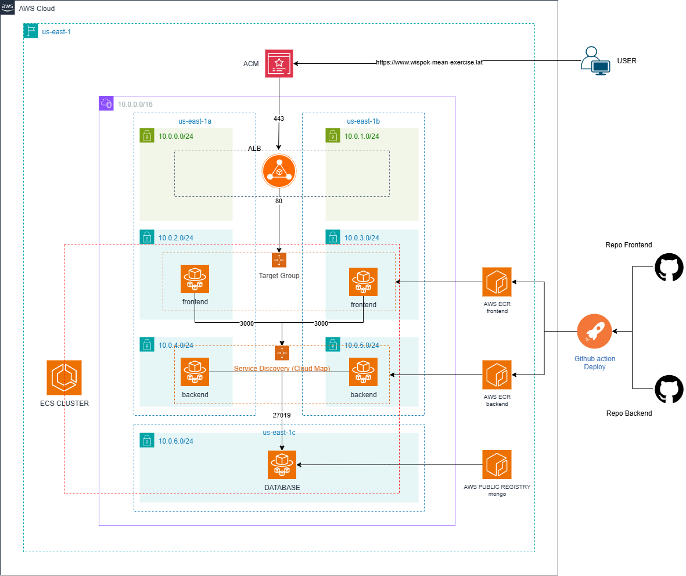

# MEAN-Stack-Exercise-Solution

## Introducción
This document shows the implemented solution for the technical challenge explained in this repository:
[Repo Challenge](https://github.com/dram2093/MEAN-Stack-Exercise-Requirements)
The architecture is based on AWS infrastructure, a backend in Node.js, a frontend in AngularJS, and a MongoDB database. All components (frontend, backend, and DB) were containerized for deployment in a production environment.

The main goal is to demonstrate an operational online app, infrastructure management with IaC tools, and automatic deployment.

## AWS infrastucture

The infrastructure was deployed in AWS using CDK (Cloud Development Kit) as an Infrastructure as Code (IaC) tool, you can reproduce this scenario in your own AWS account

### Architechture Diagram

The proposed architecture is composed of a classic network design:
- one VPC in the us-east-1 region,
- two public subnets
- five private subnets.

The public subnets contain resources that can be accessed via the internet.

The private subnets contain all application components (frontend, backend, DB).

An Application Load Balancer is exposed to the internet, with an AWS ACM Certificate to validate secure HTTPS traffic to the application (frontend).

An ECS Cluster was created with Service Discovery (Cloud Map) to generate local domains for the backend and database containers.

The frontend was deployed in containers using the ECS Fargate service and attached to the Application Load Balancer using a target group.

The backend and database (MongoDB) were also deployed in containers using the ECS Fargate service, but these resources are not exposed to the Application Load Balancer. Local domains were generated so the frontend can communicate with the backend through its own local domain, and the backend can communicate with the database using a local domain as well.

#### Repositorio de IaC
[CKD infrastructure repository ](https://github.com/leoelcoder/mean-stack-exercise-infrastructure)

##### How to deploy
Please read this [Readme](https://github.com/leoelcoder/mean-stack-exercise-infrastructure/blob/master/README.md)

## Frontend
The frontend was forked from this project [Original Repo](https://github.com/dram2093/MEAN-Stack-User-Registration-Front-End)

The application was dockerized using multi stage layer concept in order to build and imagen only with the necesary tools
to serve the application inside a container running a just only a web server exposing the  port 80.

In order to deploy automatically to the AWS infrasctructure, a *Continuos Deployment* was configured using
**Github Actions** with the following steps:
1. Checkout the code
2. Loging to ECR
3. Build, tagging and push the docker image
4. Get the task definition
5. Render the new version of the task definition
6. Deploy new revision to ECS.

For more details about the Deployment config you can review this github action [file](https://github.com/leoelcoder/MEAN-Stack-User-Registration-Front-End/blob/master/.github/workflows/deploy.yml)

or visit the [Forked Frontend repository](https://github.com/leoelcoder/MEAN-Stack-User-Registration-Front-End)

## Backend
The backend was forked from this project [Original Repo](https://github.com/dram2093/MEAN-Stack-User-Registration-Back-End)

The application was dockerized serve the application inside a container running node applucation server exposing the port 3000.

In order to deploy automatically to the AWS infrasctructure, a *Continuos Deployment* was configured using
**Github Actions** with the following steps:
1. Checkout the code
2. Loging to ECR
3. Build, tagging and push the docker image
4. Get the task definition
5. Render the new version of the task definition
6. Deploy new revision to ECS.

For more details about the Deployment config you can review this github action [file](https://github.com/leoelcoder/MEAN-Stack-User-Registration-Back-End/blob/master/.github/workflows/deploy.yml)

or visit the [Forked Backend repository](https://github.com/leoelcoder/MEAN-Stack-User-Registration-Back-End)

---

## MongoDB
For the purposes of this demo, **MongoDB was dockerized** and executed in a container with ephemeral storage.  
This provides ease of use and fast deployment, but **it is not recommended for production**.  

### Production Alternatives
- **MongoDB Atlas**: Managed and secure service.  
- **Amazon DocumentDB**: Native AWS option with full ecosystem integration.  

---

## Live Demo
The application can be accessed at the following link:  
[https://www.wispok-mean-exercise.lat/](https://www.wispok-mean-exercise.lat)

## Contact
**Autor:** Leonardo Lopez  
Email: [leonardo.lopez.deve@gmail.com](mailto:leonardo.lopez.deve@gmail.com)  
LinkedIn: [Leonardo Lopez](https://www.linkedin.com/in/leonardo-lopez-16944a51/)  
Github: [leoelcoder](https://github.com/leoelcoder)

